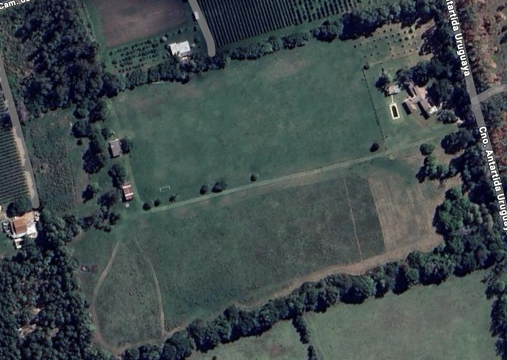

# Premier Football Growth Whitepaper

**Football Crypto Infrastructure – Uruguay**

## Executive Summary

This project proposes the creation of a **tokenized professional football club** that will compete in the Uruguayan Football Association (AUF) and CONMEBOL tournaments.

The initiative combines **real assets** (player contracts and monetizable usage rights over sports facilities), **professional club operations**, and a **transparent crypto structure**, aimed at investors seeking exposure to Real World Assets (RWA) with high upside potential through football.

**Fundraising Goal:** USD 5,000,000
**Purpose:** Establish and operate a professional football club with tokenized ownership and a Buyback & Burn model

---

## The Opportunity

Uruguay is a historic producer of elite football talent and has a proven track record in professional football:

- Low operational costs compared to European clubs
- High player export rates to international markets
- Strong football culture and infrastructure
- Access to AUF and CONMEBOL competitions

However, traditional football clubs lack transparency and accessible investment opportunities. This project seeks to **democratize football club ownership** through tokenization while building a competitive professional team.

---

## Initial Assets

The project starts with:

- **Land available** for sports city development
- **Founding team** with UEFA certifications, international experience, and a multidisciplinary background driven by a deep passion for what we do.
- **Pathway to professional competition**, with ongoing discussions with multiple clubs interested in joining the project, from which one strategic partner will be selected.

||| Current Land

||| Sports City Project

|||

---

## What You'll Find Here

- **[Introduction](introduction.md)** - Club structure, legal framework, and competitive model
- **[Technology](technology.md)** - Infrastructure and technical architecture
- **[Tokenomics](tokenomics.md)** - Token distribution, utility, and economics
- **[Revenue Model](revenue-model.md)** - Income sources from club operations and player transfers
- **[Governance](governance.md)** - Transparency, multisig, and progressive decentralization
- **[Team](team.md)** - Founding team and football expertise
- **[Roadmap](roadmap.md)** - Development timeline from club formation to CONMEBOL competition

---

!!!quote Vision
**Football is the asset. Crypto is the rail.**

This project combines professional football, club ownership, and crypto responsibly. It's not a short-term promise, but a real value creation vehicle through a competitive football club with asymmetric return potential and strong anchoring in physical assets and sporting performance.
!!!
