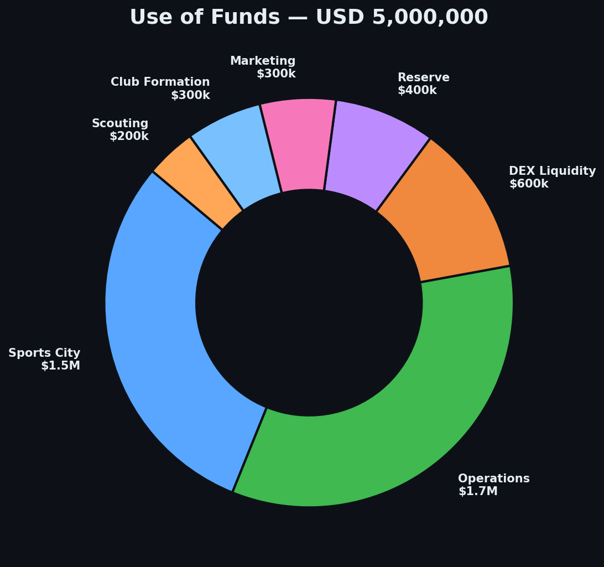

# Professional Football Growth Club Structure

## Overview

This project establishes a **professional football club** in Uruguay that will compete in the Uruguayan Football Association (AUF) and pursue participation in CONMEBOL tournaments (Copa Sudamericana, Copa Libertadores).

The club operates as a **tokenized entity**, allowing investors to participate in the economic success of a professional football team through transparent blockchain technology.

## Legal Framework

### Corporate Vehicle

**Sociedad Anónima Deportiva (SAD)** - Sports Corporation constituted in Uruguay

- The SAD is the legal entity that **owns and operates** the professional football club
- The SAD holds **permanent usufruct** of the land to build the sports city and training facilities. Includes rights to use, economic exploitation, and sub-contracting.
- The SAD manages all club operations: player contracts, competitions and commercial activities

---

## Token Structure

Token holders will have the right to:

### Economic Rights
- Benefit from the **Buyback & Reward Pool** (20-30% of Net Revenue funds token buybacks and staker rewards)
- Participate in staking programs from Day 1
- No guaranteed returns or minimum price

### Future Governance Rights
- Progressive governance rights activated based on project milestones
- Community advisory votes during early phases
- Full strategic governance activated after operational maturity
- **No control** over operational sports decisions at any stage

### Holder Benefits
- Exclusive content and behind-the-scenes access
- Sports city visits and match tickets
- NFT commemoratives for milestone events

### Transferability
- Tokens are transferable on secondary markets
- Initial liquidity pool on DEX (TOKEN / USDT)
- Protocol-owned liquidity, locked to prevent rug pulls
- Additional liquidity through buybacks

---

## Use of Funds (USD 5M)

### Key Resources

The project already has:
- **Land secured** (founders' capital investment)
- **Complete technical and management team**
- **Pathway to AUF registration**

### Capital Allocation

| Category | Amount | Purpose |
|----------|--------|---------|
| **Sports City Construction** | USD 1,500,000 | Training fields, gym, performance center, margin for overruns |
| **Club Formation & Registration** | USD 300,000 | AUF registration, initial player contracts, competition fees, equipment |
| **Operations (5+ year runway)** | USD 1,700,000 | Technical staff, management, player salaries, operational costs |
| **Strategic Reserve** | USD 400,000 | Operational buffer, emergency fund, contingencies |
| **Token Liquidity (DEX)** | USD 600,000 | Protocol-owned DEX liquidity pool |
| **Launch & Marketing** | USD 300,000 | Launchpad, community building, PR, content |
| **Scouting & Player Acquisition** | USD 200,000 | Talent identification, signing bonuses, trials |

> **Total:** USD 5,000,000

This allocation provides a **7+ year operational runway**, significantly reducing pressure on early revenue generation and allowing the team to make long-term sporting decisions without financial urgency.

---

## Realistic Horizon

The project includes **5+ years of full coverage** for the team, with additional reserves and contingency buffers that extend the effective runway to approximately 7 years.

**Target:** Achieve operational self-sustainability in 24-36 months after the start of operations.

**Design:** Financial structure does not depend on hitting this target to survive. The extended runway ensures the club can weather delays, market conditions, or slower-than-expected revenue ramp-up.

---

## Fund Management

- Funds managed from a **multisig wallet** (3-of-5 signers)
- Released in **tranches** based on milestone completion
- Full transparency and on-chain tracking
- All movements published on a public dashboard

---

!!!important Key Differentiator
Unlike purely speculative crypto projects, this initiative is backed by a **real professional football club**, **competitive operations in AUF and CONMEBOL**, and **proven revenue models** from player development and transfers in Uruguayan football.
!!!
