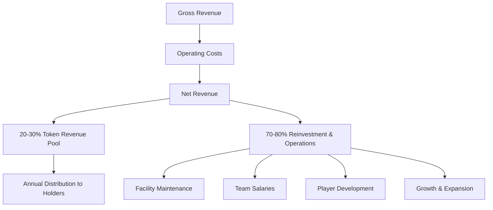

# Revenue Model

## Income Sources

### 1. Player Transfers

**Primary Revenue Driver**

- Sale of developed players to international clubs
- Transfer fees negotiated based on player performance and potential
- Historical precedent: Uruguay exports high-value talent globally

**Revenue Potential:** High upside, variable timing

---

### 2. Training Rights & FIFA Mechanisms

**FIFA Solidarity Mechanism**

- 5% of transfer fees distributed to training clubs
- Applies to all future transfers of players trained at our facility
- Passive income stream from player career progression

**Training Compensation**

- Compensation for player development costs
- Applies when players move between clubs

**Revenue Potential:** Recurring, long-tail income

---

### 3. Sell-on Clauses

**Future Transfer Participation**

- Negotiate percentage of future transfer fees
- Typical range: 10-30% of future sales
- Compounds value as players progress in their careers

**Example:**
- Player sold for USD 500k with 20% sell-on clause
- Player later sold for USD 5M
- Project receives USD 1M (20% of USD 5M)

**Revenue Potential:** High upside, long-term

---

### 4. Facility Rental

**Infrastructure Monetization**

- Rent fields and facilities to local clubs
- Host training camps and tournaments
- Corporate events and team-building activities

**Revenue Potential:** Steady, predictable income

---

### 5. Club Partnerships & Agreements

**Strategic Collaborations**

- Joint development programs with clubs
- Scouting and talent identification services
- Technical consulting and coaching services

**Revenue Potential:** Moderate, relationship-driven

---

## Revenue Distribution

### Annual Distribution Model

### Distribution Breakdown

| Category | Percentage | Purpose |
|----------|-----------|---------|
| **Token Revenue Pool** | 20-30% | Distributed to token holders annually |
| **Operations** | 30-40% | Salaries, maintenance, ongoing costs |
| **Reinvestment** | 30-40% | Facility expansion, new programs, growth |

> The exact percentage distributed to token holders is determined annually by DAO governance vote

---

## Revenue Timeline

### Year 1-2: Infrastructure Phase
- **Primary Focus:** Construction and setup
- **Revenue:** Minimal (facility rental only)
- **Funding:** Relies on initial raise

### Year 2-3: Early Operations
- **Primary Focus:** Player development begins
- **Revenue:** Facility rental + early partnerships
- **Milestone:** First player transfers possible

### Year 3-5: Revenue Generation
- **Primary Focus:** Mature operations
- **Revenue:** Player transfers + training rights + facility rental
- **Milestone:** Operational self-sustainability

### Year 5+: Scaling Phase
- **Primary Focus:** Expansion and optimization
- **Revenue:** Multiple revenue streams at scale
- **Milestone:** Consistent distributions to token holders

---

## Revenue Projections

!!!caution Conservative Approach
We do **not** provide specific revenue projections due to the variable nature of player transfers and market conditions. Success depends on:
- Quality of player development
- Market demand for talent
- Successful club partnerships
- Execution of business strategy
!!!

### Success Factors

✅ **Proven Market:** Uruguay has a track record of producing exportable talent  
✅ **Professional Infrastructure:** Modern facilities attract better talent  
✅ **Experienced Team:** UEFA-certified coaches and international experience  
✅ **Strategic Location:** Access to South American and European markets  

---

## Risk Mitigation

### Diversification
- Multiple revenue streams reduce dependency on single source
- Portfolio approach to player development

### Conservative Financial Planning
- 5-year operational runway secured
- No forced sales due to cash pressure
- Strategic decision-making over short-term gains

### Market Validation
- Existing demand for Uruguayan talent
- Established transfer market mechanisms
- Proven FIFA compensation structures

---

!!!info Transparency Commitment
All revenue and distributions will be tracked on-chain and reported to the community regularly. Token holders will have full visibility into project finances.
!!!
