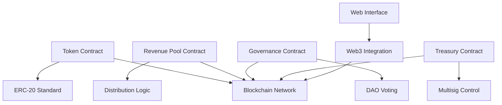

# Infrastructure & Technology

## Sports City Infrastructure

### Facility Components

**Training Fields**
- Multiple regulation-size football pitches
- Natural and artificial turf options
- Floodlighting for evening training
- Drainage and irrigation systems

**Performance Center**
- Modern gymnasium with strength and conditioning equipment
- Recovery and rehabilitation facilities
- Sports science and medical rooms
- Video analysis suites

**Player Facilities**
- Professional locker rooms and showers
- Nutrition and dining areas
- Rest and recovery spaces
- Educational facilities for young players

**Support Infrastructure**
- Administrative offices
- Coaching staff areas
- Equipment storage
- Parking and access roads

---

## Technical Architecture (Blockchain)

### Smart Contract Infrastructure

### Core Contracts

**1. Token Contract**
- ERC-20 standard implementation
- Transfer and approval functions
- Supply management
- Burn mechanism

**2. Revenue Distribution Contract**
- Annual distribution logic
- Proportional allocation to holders
- Claim mechanism
- Distribution history tracking

**3. Governance Contract**
- Proposal submission
- Voting mechanism
- Quorum and threshold validation
- Execution of approved proposals

**4. Treasury Contract**
- Multisig wallet control
- Fund allocation tracking
- Milestone-based releases
- Transparent accounting

---

## Technology Stack

### Blockchain Layer

**Network:** EVM-compatible blockchain (Ethereum, Polygon, or BSC)
- Proven security and reliability
- Wide ecosystem support
- Established DeFi infrastructure

**Smart Contracts:**
- Solidity programming language
- OpenZeppelin libraries for security
- Upgradeable proxy patterns where appropriate
- Comprehensive testing and auditing

### Application Layer

**Frontend:**
- Modern web framework (React/Next.js)
- Web3 wallet integration (MetaMask, WalletConnect)
- Responsive design for mobile and desktop
- Real-time data updates

**Backend:**
- API services for off-chain data
- Event indexing and caching
- User authentication and profiles
- Analytics and reporting

**Data Storage:**
- On-chain: Critical transactions and governance
- Off-chain: User profiles, analytics, media
- IPFS: Decentralized storage for metadata

## Data & Analytics

### Player Development Tracking

- Performance metrics and KPIs
- Training load and injury prevention
- Video analysis and tactical insights
- Progress tracking over time

### Business Intelligence

- Revenue tracking and forecasting
- Token holder analytics
- Governance participation metrics
- Market analysis and trends

---

## Infrastructure Timeline

### Phase 1: Construction (Months 1-12)

- Site preparation and groundwork
- Field construction and installation
- Building construction (gym, facilities)
- Infrastructure setup (power, water, data)

### Phase 2: Equipment & Setup (Months 10-15)

- Gym equipment installation
- Technology systems deployment
- Furniture and fixtures
- Safety and compliance certifications

### Phase 3: Operations Launch (Month 15+)

- Facility opening
- Initial player intake
- Staff onboarding
- Systems go-live

---

!!!tip Modern Standards
Our infrastructure will meet or exceed international standards for professional football training facilities, ensuring we can attract and develop top-tier talent.
!!!
