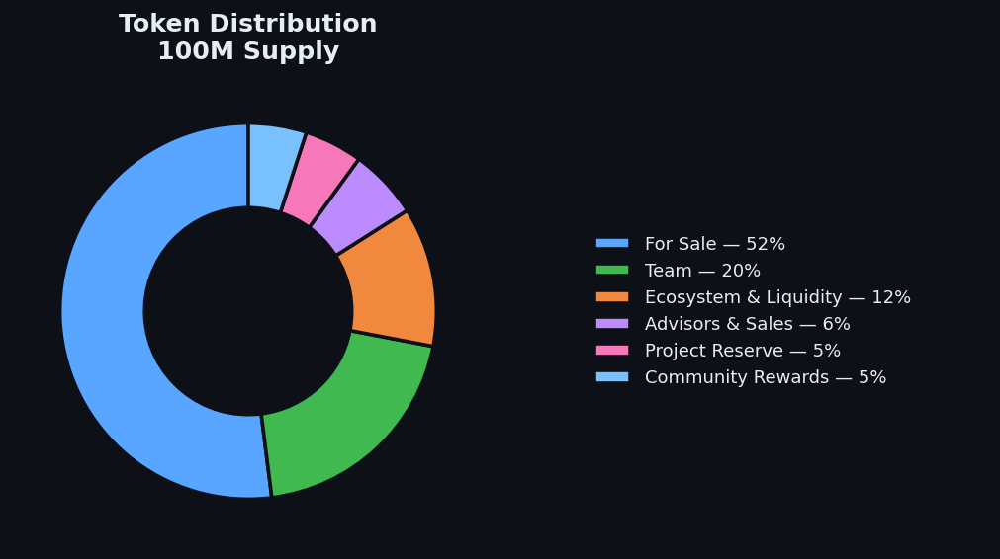
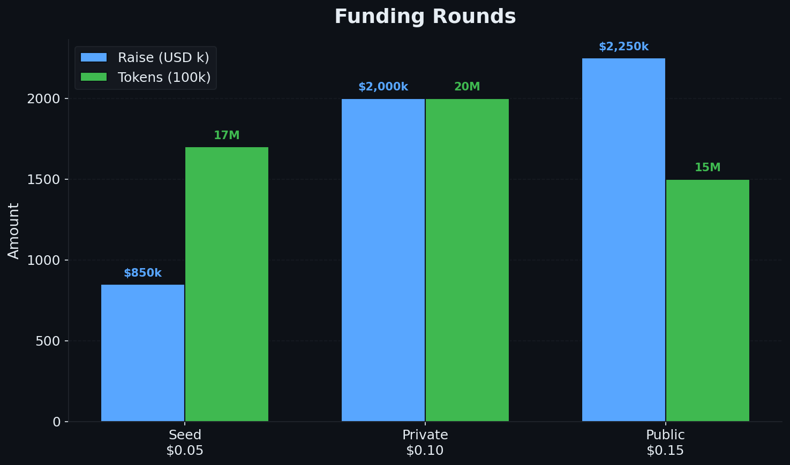
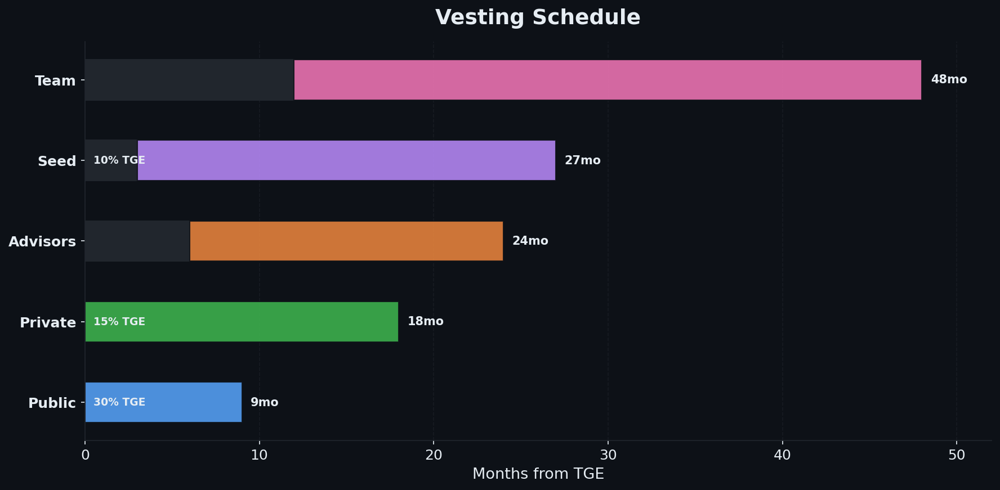

# Tokenomics

## Token Supply

**Total Supply:** 100,000,000 tokens

### Distribution

| Category | Allocation | Tokens | Notes |
|----------|-----------|--------|-------|
| **For Sale** | 52% | 52,000,000 | Distributed across 3 funding rounds |
| **Team** | 20% | 20,000,000 | Founders and core team, longest vesting |
| **Ecosystem & Liquidity** | 12% | 12,000,000 | DEX liquidity, future CEX, staking rewards, partnerships |
| **Advisors & Sales** | 6% | 6,000,000 | Strategic advisors, KOLs, sales agents, commissions |
| **Project Reserve** | 5% | 5,000,000 | On-chain strategic reserve for future needs |
| **Community Rewards** | 5% | 5,000,000 | Staking programs, engagement, holder benefits |

Long-term founder alignment with multi-year vesting tied to operational execution. Team vesting is the longest of all categories.

---

## Funding Rounds

### Round Structure

| Round | Allocation | Price | Total Raise | Investor Profile |
|-------|-----------|-------|-------------|-----------------|
| **Seed** | 17% (17M) | USD 0.05 | USD 850,000 | Inner circle, football contacts, local investors |
| **Private** | 20% (20M) | USD 0.10 | USD 2,000,000 | Crypto funds (RWA), angels, football industry |
| **Public / Launchpad** | 15% (15M) | USD 0.15 | USD 2,250,000 | Via launchpad platform, open access |

> **Total Fundraising Target:** ~USD 5,000,000
> **Fully Diluted Valuation at Listing:** USD 15,000,000

### Round Step-ups

| Transition | Multiplier | Rationale |
|-----------|-----------|-----------|
| Seed → Private | 2.0x | Early risk premium; Seed enters before SAD formation |
| Private → Public | 1.5x | Public gets immediate liquidity and no KYC |

### Release & Vesting Schedule

| Category | Release Schedule | Total Lock Period |
|----------|------------------|-------------------|
| **Team (20%)** | 12-month cliff, then linear vesting over 36 months | 48 months |
| **Advisors & Sales (6%)** | 6-month cliff, then linear vesting over 18 months | 24 months |
| **Seed Round** | 10% at TGE, 3-month cliff, then linear over 24 months | 27 months |
| **Private Round** | 15% at TGE, then linear over 18 months | 18 months |
| **Public / Launchpad** | 30% at TGE, then linear over 9 months | 9 months |
| **Ecosystem & Liquidity** | Milestone-based, managed by team | Ongoing |
| **Project Reserve** | Locked, released by team decision with community advisory input | Ongoing |
| **Community Rewards** | Distributed through staking and engagement programs | Ongoing |

> The founding team has the **longest vesting of all categories** (48 months). No buyer is locked longer than the team.

### Circulating Supply at TGE

| Source | Unlock | Tokens |
|--------|--------|--------|
| Seed (10% TGE) | 10% of 17M | 1,700,000 |
| Private (15% TGE) | 15% of 20M | 3,000,000 |
| Public (30% TGE) | 30% of 15M | 4,500,000 |
| **Total at TGE** | | **~9,200,000 (9.2%)** |

Initial market cap at TGE: ~USD 1,380,000

---

## Token Utility

### 1. Buyback & Reward Participation
- Holders benefit from the **Buyback & Reward Pool**
- 20-30% of Net Revenue funds token buybacks from the open market
- Bought tokens are distributed to **active stakers** and partially **burned**
- Creates sustained buy pressure and reduces circulating supply over time

### 2. Future Governance Rights
- Token holders will gain progressive governance rights as the project matures
- Governance is activated based on project milestones, not arbitrary timelines
- Initial governance: community advisory votes (non-binding)
- Full strategic governance: activated after facility is operational and revenue is generated
- **No control** over operational sports decisions at any stage

### 3. Staking & Rewards
- Stake tokens to earn rewards from the Community Rewards pool
- Stakers receive priority in Buyback & Reward distributions
- Staking available from Day 1 of TGE

### 4. Holder Benefits
- Exclusive content access (training sessions, behind the scenes)
- Sports city visits and match tickets
- NFT commemoratives for milestone events
- Early access to future products or rounds

### 5. Transferability
- Trade on secondary markets
- DEX liquidity pool (TOKEN / USDT)
- Potential CEX listings in the future

---

## Liquidity Strategy

### Initial Liquidity

- **USD 600,000** allocated for initial DEX pool (protocol-owned liquidity)
- Liquidity **locked** to prevent rug pulls
- Deployed at TGE on Solana DEX (Raydium, Orca, or Jupiter)

### Ongoing Liquidity

- **Buybacks** from the Buyback & Reward Pool create sustained demand
- **Staking Programs** incentivize long-term holding, reducing circulating supply
- Gradual liquidity expansion as trading volume grows
- Market-driven price discovery

> **No guarantees** on liquidity, trading volume, or minimum price

---

## Buyback & Reward Pool

### How It Works

1. **20-30% of Net Revenue** is allocated to the Buyback & Reward Pool each period
2. The Pool **buys tokens from the open market** (DEX), creating buy pressure
3. A portion of bought tokens is **distributed to active stakers** as rewards
4. A portion is **burned**, permanently reducing supply

### Net Revenue Definition

> **Net Revenue** = Gross revenue from all sources (player transfers, training rights, sell-on clauses, TV rights, and competition bonuses) minus direct operational costs (staff salaries, facility maintenance, competition fees, player development costs, and regulatory compliance).
>
> **Excluded:** Capital expenditures funded from the initial raise are not deducted.

### Pool Rules

- **Minimum threshold:** Pool does not activate if Net Revenue < USD 100,000 in the period
- **Negative periods:** No debt accumulation. The Pool simply does not operate
- **Audit:** Annual independent review, results published on-chain
- **Percentage decision:** Set by the founding team (Phase 1-3), with community advisory input. Full community governance over the percentage is activated at a later milestone.

---

## Milestone Token Burns

At each major project milestone, tokens from the Ecosystem reserve are permanently burned:

| Milestone | Burn Amount |
|-----------|------------|
| Sports city construction complete | 1,000,000 tokens |
| First professional player signed | 500,000 tokens |
| First competitive match | 500,000 tokens |
| First player transfer | 2,000,000 tokens |
| **Total potential burn** | **4,000,000 tokens** (33% of Ecosystem) |

Burns reduce total supply, rewarding all holders with increased scarcity.

---

## Economic Model

### Revenue Sources

1. **Player Transfers** - Primary revenue driver
2. **Training Rights** - FIFA solidarity and compensation mechanisms
3. **Sell-on Clauses** - Future transfer participation
4. **TV Rights & Competition Revenue** - AUF and CONMEBOL distributions

---

## Token Value Drivers

### Short-term
- Successful fundraising completion
- Sports city construction progress
- Milestone token burns
- Staking rewards from Day 1

### Medium-term
- First player transfers
- Buyback & Reward Pool activation
- Revenue generation begins

### Long-term
- Consistent player export pipeline
- Sustained buyback pressure
- Supply reduction through burns
- Facility expansion

---

!!!warning Disclaimer
This token does **not promise guaranteed returns**. It represents participation rights in a real-world business with inherent risks. Token value depends on project execution and market conditions. Only invest what you can afford to lose.
!!!
