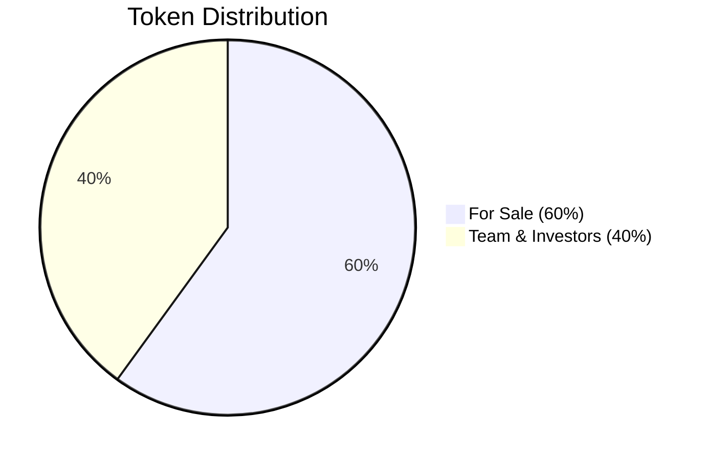
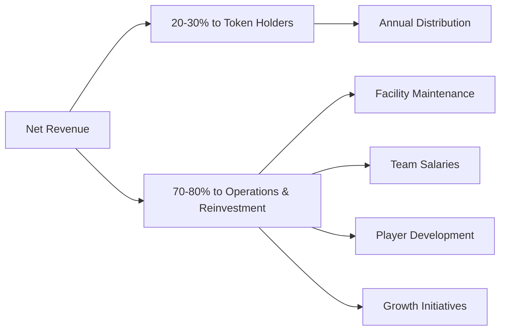

# Tokenomics

## Token Supply

**Total Supply:** 100,000,000 tokens

### Distribution

| Category | Allocation | Notes |
|----------|-----------|-------|
| **For Sale** | 60% | Distributed across funding rounds |
| **Team & Investors** | 40% | Subject to long-term vesting |

---

## Funding Rounds

### Round Structure

| Round | Allocation | Price | Total Raise |
|-------|-----------|-------|-------------|
| **Founder Round** | 20% | USD 0.03 | USD 600,000 |
| **Community Round** | 20% | USD 0.05 | USD 1,000,000 |
| **Liquidity / Public** | 20% | USD 0.07+ | USD 1,400,000+ |

> **Total Fundraising Target:** USD 3,000,000

### Vesting Schedule

- **Team tokens:** Long-term vesting schedule
- **Founder round:** Gradual unlock over time
- **Community & Public:** Immediate transferability

---

## Token Utility

### 1. Revenue Participation
- Holders participate in **annual Revenue Pool**
- 20-30% of Net Revenue distributed to token holders
- Distribution proportional to token holdings

### 2. Governance Rights
- Vote on treasury allocation
- Vote on project expansion decisions
- Vote on annual distribution percentage
- **No control** over operational sports decisions

### 3. Transferability
- Trade on secondary markets
- DEX liquidity pool (TOKEN / USDC)
- Potential CEX listings in the future

---

## Liquidity Strategy

### Initial Liquidity

- **USD 250,000** allocated for initial DEX pool
- Liquidity **locked** to prevent rug pulls
- Limited initial liquidity to maintain price stability

### Ongoing Liquidity

- **Buybacks** from Revenue Pool
- Gradual liquidity expansion
- Market-driven price discovery

> ⚠️ **No guarantees** on liquidity or minimum price

---

## Economic Model

### Revenue Sources

1. **Player Transfers** - Primary revenue driver
2. **Training Rights** - FIFA mechanisms
3. **Sell-on Clauses** - Future transfer participation
4. **Facility Rental** - Additional income stream
5. **Club Partnerships** - Strategic agreements

### Distribution Model

---

## Token Value Drivers

### Short-term
- Successful fundraising completion
- Sports city construction progress
- Initial club partnerships

### Medium-term
- First player transfers
- Revenue generation begins
- Initial distributions to holders

### Long-term
- Consistent player export pipeline
- Facility expansion
- Regional platform development

---

!!!warning Disclaimer
This token does **not promise guaranteed returns**. It represents participation rights in a real-world business with inherent risks. Token value depends on project execution and market conditions.
!!!
